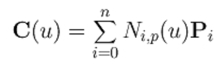
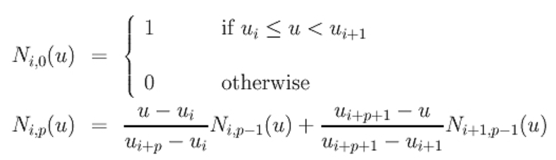
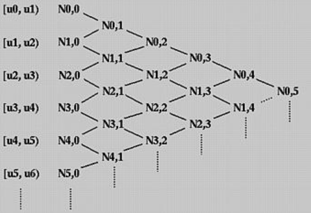
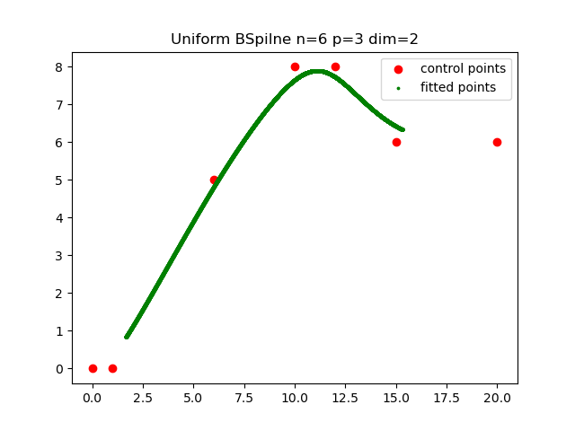
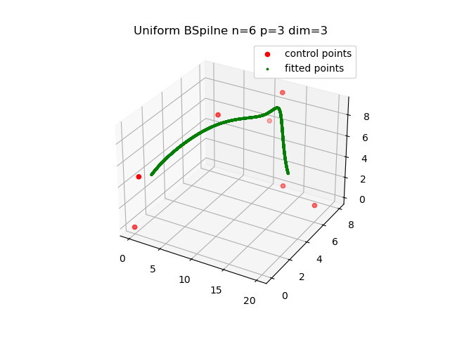
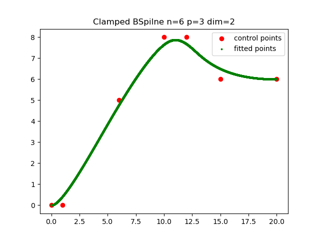
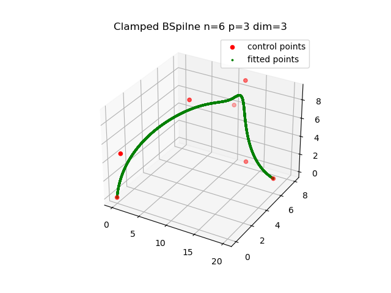

# B样条曲线
## 1. Instruction
B样条（B-Spline）是一种曲线拟合方法，相较于Bezier曲线，B-Spline更容易局部调整。

本例程实现原理、符号定义与 https://pages.mtu.edu/~shene/COURSES/cs3621/NOTES/ 一致
## 2. Some Important Points
### 2.1 Definition:

Where N is the basis function, which is defined below:

We can calculate the basis function, recursively. And the kont vector is defined below:

knot vector = ${u_0,u_1,...,u_m}(m=n+p+1)$ 

 
 BSpiline上的一个点最多受p+1个点的影响，而一个基函数$N_{i,p}$仅在其local support span $[u_i, u_{i+p+1})$ 产生作用

### 2.2 Recursive Diagram

There are there are at most p+1 degree p non-zero basis functions of degree p  on a knot span $[u_i, u_{i+1})$

### 2.2 Classification
2.2.1 Open Curve

定义在$[u_p, u_{m-p}]$, 因为只有在这些区间上，才有足够多（最多p+1个）的非零基函数对该区间support。

特别地，如果矢量节点均匀分布，则为**Uniform BSpline**. 如果前p+1个矢量节点重复并且最后p+1个矢量节点重复，则为**Clamped BSpline**.

Clamped BSpline 经过第一个Control Point和最后一个Control Point，并且和第一个control polyline以及最后一个control polyline相切。本代码是对 **Uniform BSpline**和**Clamped BSpline**的实现。

2.2.2 Closed Curve

## 3. Result
### Uniform BSpline拟合2d点

### Uniform BSpline拟合3d点

### Clamped BSpline拟合2d点

### Clamped BSpline拟合3d点

参考资料：https://pages.mtu.edu/~shene/COURSES/cs3621/NOTES/